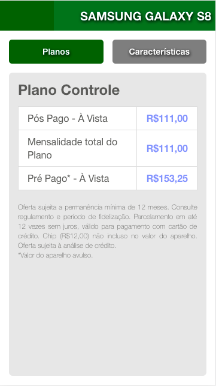

# Notas de Thiago

Versão PHP 8 <

Para rodar o projeto : `php -S localhost:8000 -t public`

O objetivo com esse repositório é aplicar oque eu pretendia fazer ao ver este
teste pela primeira vez (sem a limitação de tempo e pressão de ter alguem me observando), e também, aplicar algumas estruturas e patterns a mais como forma de estudo e prática. 

# Objetivo

O objetivo deste teste é propor um sistema que se encarrega de exibir preço dos planos vendidos junto aos aparelhos de telefone e a sua principal característica é a possibilidade de associar vários planos a um telefone.

# Critérios de aceitação

O candidato deverá escrever um programa que receberá uma lista de planos(data.json) e deverá retornar a lista filtrada baseada nos critérios abaixo:

* O sistema só poderá exibir planos que tenham schedule.startDate válidos, ou seja, menor que a data atual.
* O sistema só poderá exibir 1 única vez planos que tenham os mesmos : name, localidade dando preferência quem possuir o schedule.startDate mais recente.
* Note que o campo localidade possui uma hierarquia (PAÍS -> ESTADO -> CIDADE). Esta hierarquia deverá ser respeitada, de maneira que a cidade terá maior prioridade que estado e país. O sistema só poderá exibir 1 única vez planos que tenham os mesmos : name dando preferência a hierarquia de localidades.

# Critérios de avaliação

*   **Funcionalidade**: atender todos os critérios de aceitação mencionados;
*   **Organização do projeto**: diretórios, arquivos, classes, ...;
*   **Legibilidade do código**;
*   Adoção de boas práticas de desenvolvimento de software;
*   **Criatividade**: O escopo deste teste é bem aberto, do ponto de vista de requisitos técnicos, propositalmente, para que você possa demonstrar sua criatividade. :)
*   **Propor melhorias  no arquivo JSON disponibilizado.**

# O que será permitido

Para este teste será permitido:

*   Pesquisar no Google;
*   **É permitido** perguntar sobre as regras de negócio para o entrevistador;
*   Utilizar a linguagem de programação Javascript.
*   **Não é permitido** utilizar frameworks ou bibliotecas de terceiros. Ex.: lodash, jquery, angular, etc.

